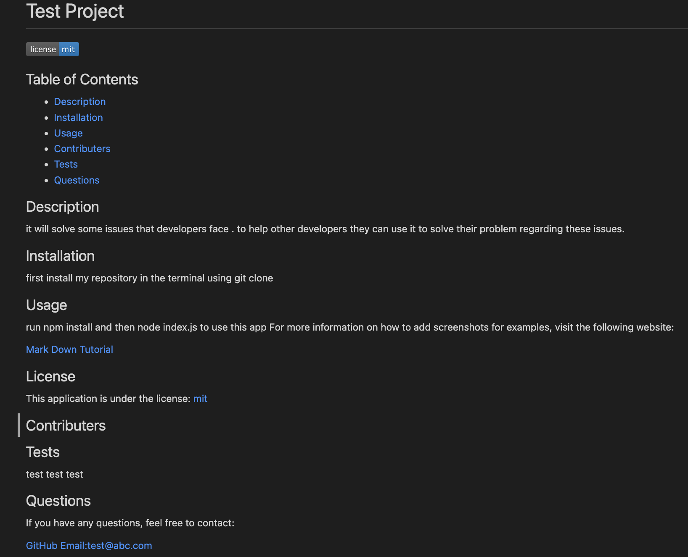

# README Generator
### Contents

1. Discription of Project
2. Video of README
3. Screenshot
4. Installation 
5. Usage
6. Acknowledgements
7. Questions

## Description of Project
   My project is commandline node.js application to create a professional README file by taking in user input by asking few questions. User don't have to worry about proper markdown syntex and can easily create and include README.md in their projects.

## Video of README

Following is the link to my walkthrough video:

https://watch.screencastify.com/v/bcugT94hFRwVYJVusCid

## Screenshot
Following is the screenshot of my test README:

## Installation 

Git clone this repository using terminal and open the file in VS Code (or in the editor you work with). Install dependencies using "npm install" in terminal and make sure that you are in the reposetory directory, before running "npm install". Now you are ready to use this application.

## Usage

Once instalation is complete, you should run "node index.js" in the terminal,while you are in the repository directory. 
you will be asked some questions. After you answer all the questions, a README will be created in the sample folder. 
you can the copy that README.md into your project without thinking about all the syntex.

## Acknowledgements

This project is done for UNB Bootcamp, thanks for the opertinity. I am thankful to its-jefe and mjgiannelli for thge code inspiration. My Tutor was quite helpful.

## Questions

If you have any questions, please reach out to me at my github.

https://github.com/calligraphist

